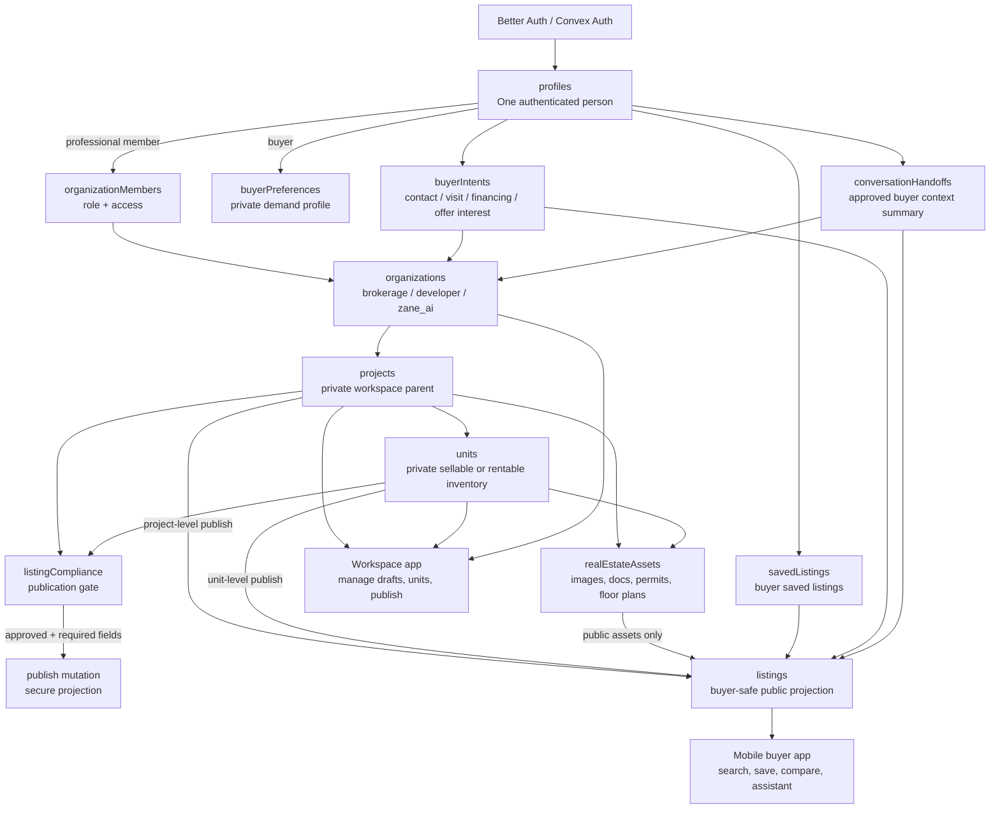
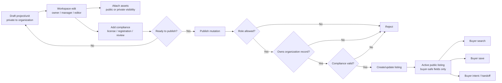
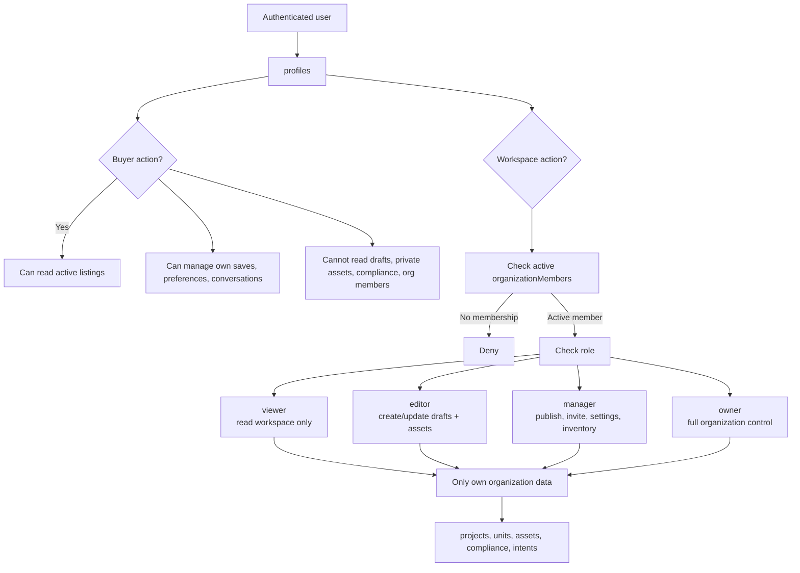
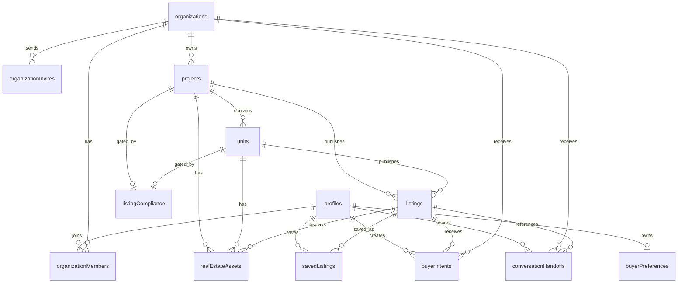

# Zane-ai Unified Real Estate Core Schema Flow

This document describes the new Convex schema flow for the Zane-ai real estate core.

The core idea is simple:

- `organizations` own private real estate supply.
- `projects` and `units` are workspace/private records.
- `listings` are buyer-safe public projections.
- `profiles` own buyer demand through preferences, saves, intents, and handoffs.
- Private workspace data never leaks directly to buyers or other organizations.

## Core Flow

## Publication Flow

## Access Rules Flow

## Entity Relationship View

## Table Responsibilities

| Table | Responsibility | Visibility |
| --- | --- | --- |
| `profiles` | One authenticated person in Zane-ai. | Own profile only, except workspace member display. |
| `organizations` | Brokerages, developers, and Zane-ai internal teams. | Members can read their own organization. |
| `organizationMembers` | Role-based workspace access. | Organization scoped. |
| `organizationInvites` | Pending team invite flow. | Invitee by email/token, managers/owners by organization. |
| `projects` | Private parent record for compounds, buildings, developments, or standalone groups. | Owning organization only until projected into listings. |
| `units` | Private sellable/rentable inventory under a project. | Owning organization only until projected into listings. |
| `listings` | Buyer-safe searchable projection. | Public when `status = "active"`. |
| `realEstateAssets` | Images, videos, documents, permits, and floor plans. | Depends on `visibility`. |
| `listingCompliance` | Publication gate and private compliance notes. | Owning organization only. |
| `buyerPreferences` | Buyer-owned demand profile. | Buyer only unless explicitly shared. |
| `savedListings` | Buyer saved listings. | Buyer only. |
| `buyerIntents` | Buyer contact, visit, financing, or offer interest. | Buyer and target organization. |
| `conversationHandoffs` | Approved buyer context shared with an organization. | Buyer and target organization. |

## Core Rules

- Buyers query `listings`, not `projects` or `units`.
- Workspace users manage `projects`, `units`, `realEstateAssets`, and `listingCompliance`.
- Publishing creates or updates a buyer-safe `listing`.
- Private files, compliance notes, internal drafts, and organization-only metadata are never copied into `listings`.
- Saves are keyed by `profileId + listingId`.
- Organization access is always checked through active `organizationMembers`.
- Public Convex functions still need authorization because first-party clients can call them directly.
- Use child tables for unbounded data: assets, saves, intents, handoffs, analytics, messages, and events.
- Use indexed, bounded, or paginated reads for growing tables.

